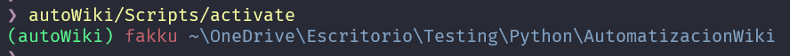
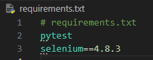

# Proyecto Wikipedia

## Entorno Virtual 
Para crear un nuevo entorno virtual utilizaremos el comando 
```
python -m venv nombreProyecto
```
> **venv** nos permite aislar las versiones de librerias en nuestro proyecto

Para activar el entorno virtual debemos ubicarnos en la raiz de nuestro proyecto (donde ejecutamos el comando anterior), y colocar

```
nombreProyecto/Scripts/activate
```
Debiendo quedar la termial con el nombre del entorno como se ve en el ejemplo


para salir del entorno solo debemos colocar
```
deactivate
```
y se quitara el nombre del entorno en nuestra terminal

!!! note:   

## Instalando las dependencias

en nuestro proyecto deberemos tener un archivo requerements.txt en el cual tendremos las librerias con sus respectivas versiones como se ve en el ejemplo



Para instalarlas ejecutamos el siguiente comando 
```
pip install -r requirements.txt
```